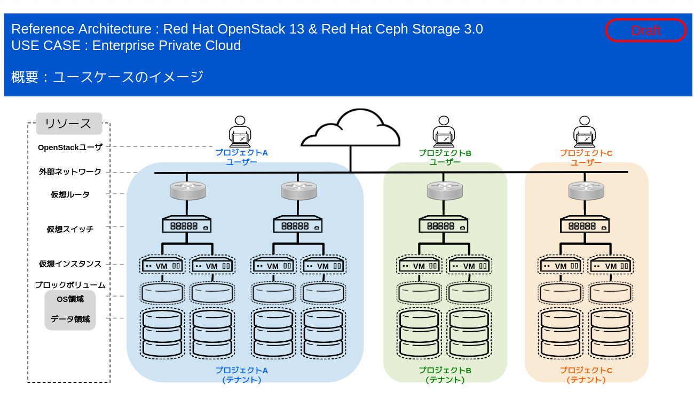

# 企業プライベートIaaS 標準構成

## 概要

このクラウドデザインターンでは、Red Hat OpenStack を、企業のプライベートクラウドとして利用することを想定し、その標準的な構成方法をまとめます。

* プライベートクラウドの具体的なユースケース
  * クラウド利用者は、OpenStack 上に、クローズドのプライベートネットワークが作成できる。
  * 各クラウド利用者が作成したネットワークのIPアドレス空間は、個々のプライベートネットワーク間で干渉しない。
  * クラウド利用者は、OpenStack 上に、ゲストVMを起動できる。
  * ゲストVMは、Floating IP を介して、外部のネットワークと相互通信でき、その通信は、ポートレベルで制御できる。
  * クラウド利用者は、ゲストVMを、予め用意されたゲストOSイメージから起動できる。ゲストOSのイメージは利用者でも登録できる。
  * クラウド利用者は、ゲストVMのキャパシティを自由には設定できないが、予め用意されているカタログ（flavor) から、要件に近いものを選択して利用することができる。
  * クラウド利用者は、ゲストVMに対して、拡張のストレージ領域を接続できる。
  * クラウド利用者は、オブジェクトストアサービスを利用して、クラウド環境上にファイルのアップロードし、その他のユーザに対して公開できる。

### * [計画／設計編](./design/design.md)
### * [構築／実装編](./build/build.md) *** 準備中 ***

